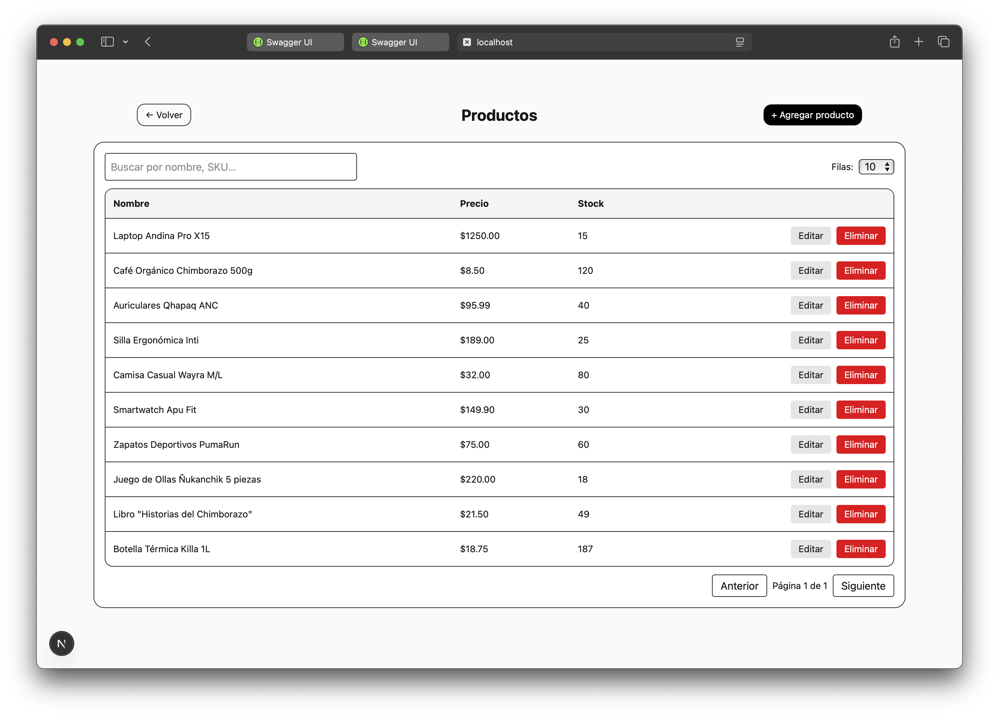
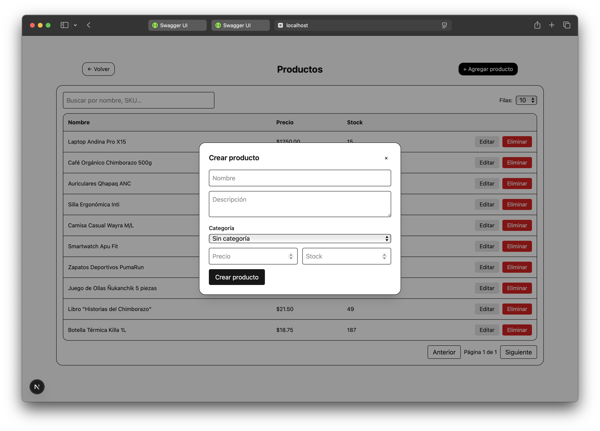
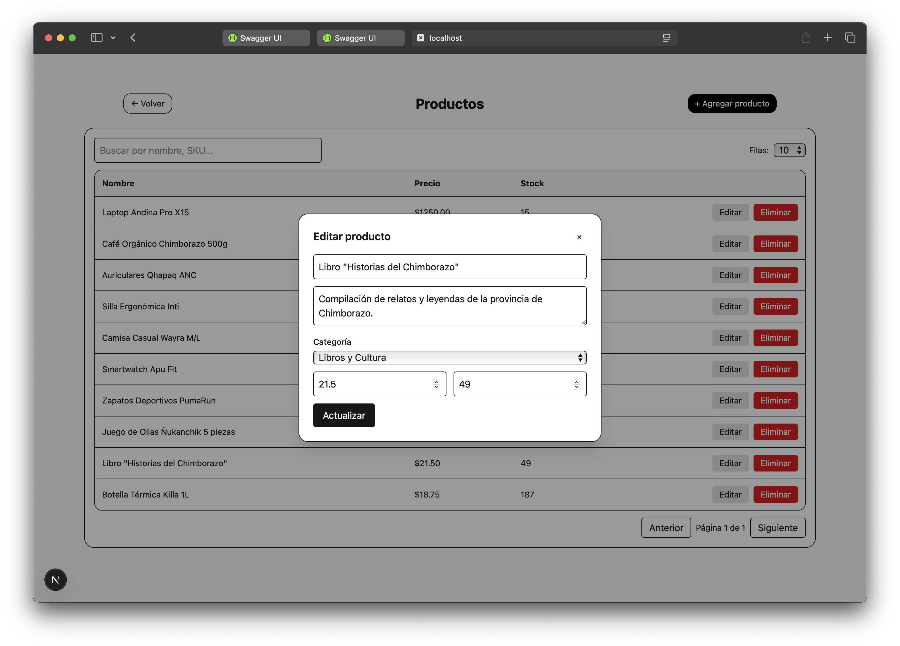
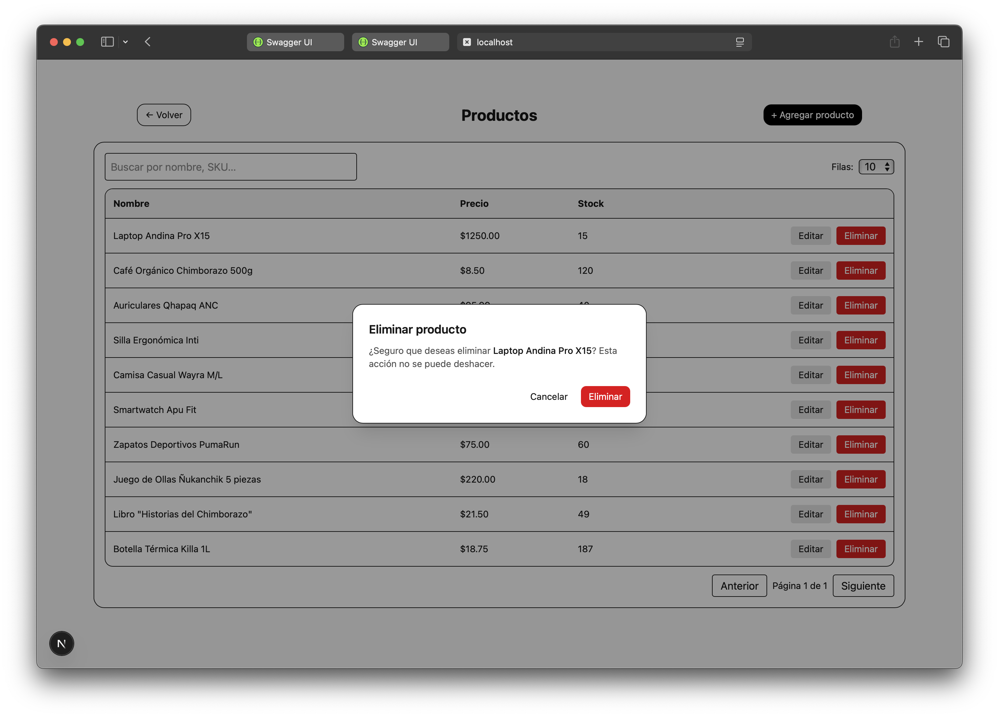
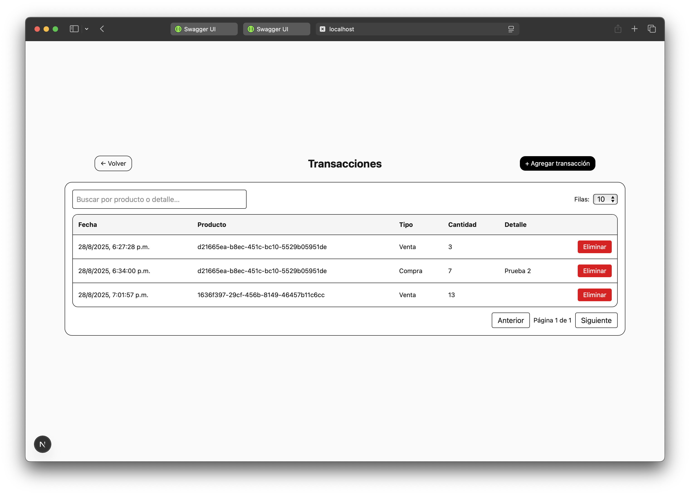
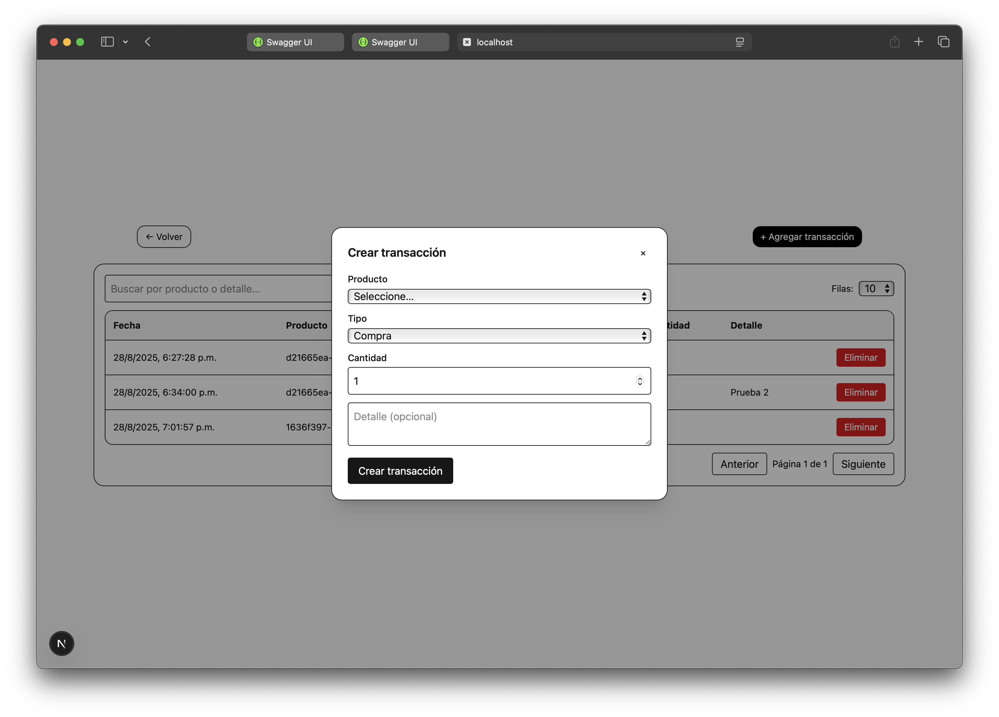
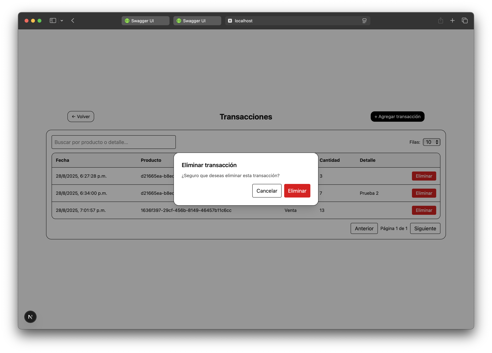

# Evaluación Técnica FullStack - Gestión de Inventarios

Este proyecto implementa una aplicación web para la **gestión de productos y transacciones de inventario**, siguiendo una arquitectura de **microservicios en .NET** y un **frontend en React**.

---

## 📦 Estructura de Carpetas

```
.
├── Back-End/                       # Solución .NET con microservicios
│   ├── Service-Products/           # CRUD de productos + stock
│   ├── Service-Transactions/       # Compras/ventas + validación y ajuste de stock
│   └── .config/dotnet-tools.json   # Manifest de herramientas (dotnet-ef 7.0.20)
│
├── Front-End/                      # Aplicación React
│   ├── app/                        # Rutas, vistas y handlers (incluye /api si aplica)
│   └── lib/                        # Código compartido
│       ├── api/                    # Cliente HTTP (axios/fetch)
│       ├── components/             # Componentes UI
│       ├── types/                  # Tipos/TS
│       └── validators/             # Zod u otros validadores
│
├── schema.sql                      # Script SQL inicial (DB)
└── README.md
```

---

## 📋 Requisitos

- **.NET 7 SDK** o superior
- **Node.js 18+** y **npm**
- **Motor SQL** a elección (SQL Server / PostgreSQL / MySQL). Debes ajustar la cadena de conexión en `appsettings.*.json`.
- Editor recomendado: VS Code

> ℹ️ La prueba solo exige **“Base de datos SQL”**. Se incluye `schema.sql` en la raíz para creación manual si prefieres no usar migraciones.

---

## ⚙️ Backend (.NET) — Ejecución

El backend está compuesto por **dos microservicios** dentro de `Back-End/`:

1) `Service-Products` – Gestión de productos y stock  
2) `Service-Transactions` – Registro/edición de transacciones y coordinación de stock con `Products`

### 1) Restaurar herramientas y dependencias

Desde `Back-End`:

```bash
# Restaura herramientas locales definidas en .config/dotnet-tools.json
dotnet tool restore
```

En `Back-End/Service-Products` y `Back-End/Service-Transactions`:

```bash
# Restaura paquetes NuGet
dotnet restore
```

> El manifest incluye:
> ```json
> {
>   "version": 1,
>   "isRoot": true,
>   "tools": {
>     "dotnet-ef": { "version": "7.0.20", "commands": ["dotnet-ef"] }
>   }
> }
> ```

### 2) Variables y cadenas de conexión

Configura `appsettings.json` en **cada** microservicio (`Back-End/Service.Products` y `Back-End/Service.Transactions`), por ejemplo:

```json
{
  "ConnectionStrings": {
    "Default": "Host=localhost;Port=5432;Database=ms-<microservicio>;Username=postgres;Password=<clave>"
  },
}
```

Reemplazar `<clave>` por la clave de la base de datos (PostgreSQL).

- `Products:BaseUrl` lo usa el microservicio de **Transacciones** para comunicarse con **Products**.

### 3) Crear/Actualizar la base con migraciones EF

> Usa **dotnet-ef 7.0.20** restaurado como herramienta local.

```bash
# Service-Products y Service-Transactions
dotnet ef database update
```

> Alternativa manual: ejecutar `schema.sql` directamente en tu motor SQL.

### 4) Levantar los microservicios

```bash
# En terminales separadas
dotnet run
```

**Endpoints por defecto (desarrollo):**
- Products API: `http://localhost:5114/api/products`
- Transactions API: `http://localhost:5115/api/transactions`

---

## 🎨 Frontend (React) — Ejecución

1) Instalar dependencias:

```bash
cd Front-End
npm install
```

2) Configurar variables de entorno (`Front-End/.env.local`):

```env
INTERNAL_PRODUCTS_API=http://localhost:5114/api
INTERNAL_TRANSACTIONS_API=http://localhost:5115/api
```

3) Ejecutar en desarrollo:

```bash
npm run dev
# Acceder en http://localhost:3000
```

### Estructura relevante

- `Front-End/app` → Páginas/rutas (y `app/api` si usas rutas de API locales)  
- `Front-End/lib/api` → Cliente HTTP centralizado (axios/fetch)  
- `Front-End/lib/validators` → Esquemas (p.ej., Zod)  
- `Front-End/lib/components` → Tablas con paginación, formularios con validación, modales, etc.

---

## 🔌 Integración entre Servicios

- `Service-Transactions` consulta/valida producto y stock en `Service.Products` y **ajusta stock** según el `TransactionType` (*Purchase*|*Sale*).
- Campos clave:
  - **Producto**: `Id`, `Name`, `Description`, `CategoryId`, `Image`, `Price (decimal 18,2)`, `Stock (int)`, `IsActive`.
  - **Transacción**: `Id`, `Date`, `Type (1=Purchase, 2=Sale)`, `ProductId`, `Quantity`, `UnitPrice (18,2)`, `TotalPrice (18,2)`, `Detail`.

> Reglas: No vender más stock del disponible. No permitir transacciones si el producto está inactivo.

---

## 📷 Evidencias

- **Productos**: listado dinámico con paginación, crear, editar, eliminar





- **Transacciones**: listado dinámico con paginación, crear, eliminar




- **Filtros**: por fechas y tipo (compra/venta)

---

## 🧪 Comandos útiles

```bash
# Crear nueva migración (Products)
dotnet ef migrations add InitProducts

# Crear nueva migración (Transactions)
dotnet ef migrations add InitTransactions
```

---

## 🗂️ Script SQL inicial

Se provee `schema.sql` en la **raíz** del repo con la definición mínima de tablas para Productos y Transacciones compatible con motores SQL comunes.
Ajusta tipos si cambias de DBMS (por ejemplo, GUID/UUID, decimal, etc.).

---

## ✅ Criterios de Aceptación

- [x] Listados dinámicos con paginación (productos y transacciones)
- [x] CRUD de productos y transacciones
- [ ] Filtros avanzados por fechas y tipo de transacción
- [x] Validaciones (no vender stock inexistente, formularios, etc.)
- [x] APIs RESTful por microservicio
- [x] Script SQL `schema.sql` en la raíz
- [x] Proyecto en **un solo repositorio** y **una sola rama**

---

✍️ Autor: *Ricardo Carrión*  
📅 Fecha: Agosto 2025
